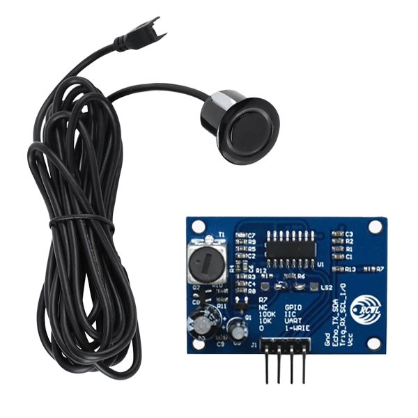
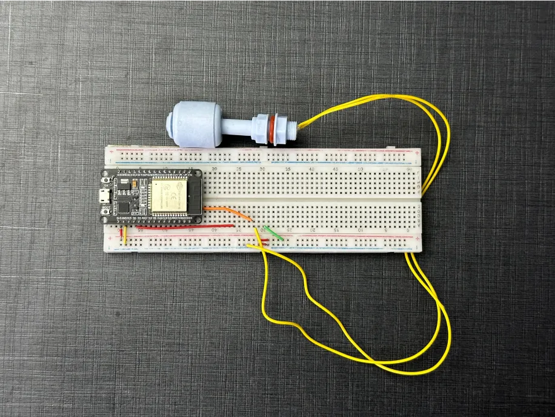
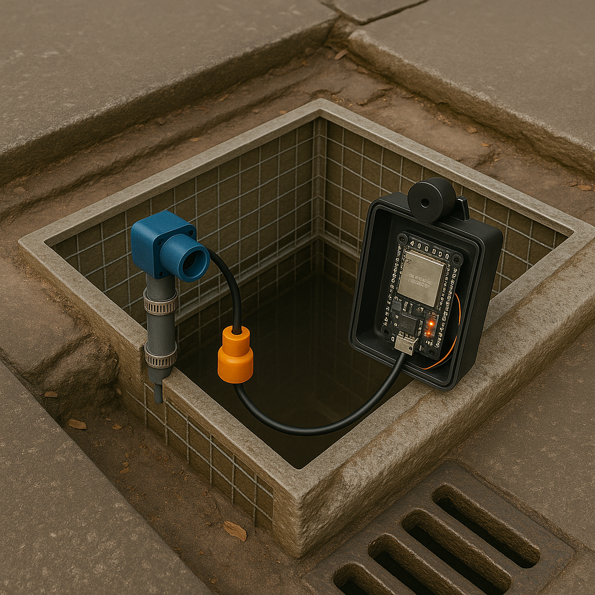
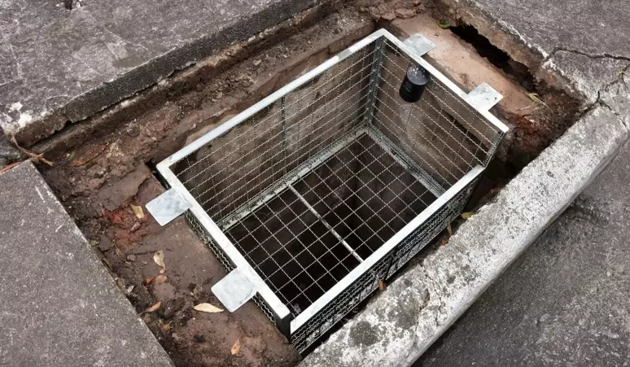

# Alagaqui - Sistema de Monitoramento de Inundações

## 👥 Equipe
- Alexsandro Macedo — RM557068  
- Leonardo Faria Salazar — RM557484  
- Guilherme Felipe da Silva Souza — RM558282

---

## 📖 Descrição do Projeto

**Alagaqui** é um sistema de monitoramento em tempo real de bueiros e bocas de lobo para prevenção de enchentes. Utiliza sensores ultrassônicos JSN-SR04T para identificar o **nível da água** e um potenciômetro simulando uma boia magnética que complementa a leitura de **obstrução**. 

O dispositivo é conectado via Wi-Fi e envia os dados por **protocolo MQTT**, utilizando o broker **CloudAMQP**, para serem processados e visualizados em tempo real no **Node-RED**, com destaque para um **mapa de calor interativo** que mostra os pontos de risco com base nas coordenadas GPS dos bueiros.

Link do simulador Wokwi: [https://wokwi.com/projects/432803480845522945](https://wokwi.com/projects/432803480845522945)

Link para o video: [https://youtu.be/WJWTfMjoVfw](https://youtu.be/WJWTfMjoVfw)

---

## 🧠 Funcionalidades

- Leitura de nível de água com sensor ultrassônico JSN-SR04T  
- Detecção complementar de obstrução via potenciômetro (simulando boia)  
- Envio de dados via MQTT para o broker CloudAMQP  
- Processamento dos dados com Node-RED  
- Geração de alertas com base no nível ou obstrução 

---

## 🔧 CloudAMQP credenciais (Broker MQTT)

- Hostname: `albatross.rmq.cloudamqp.com`  
- Porta: `1883`  
- Username: `iuyaxzit:iuyaxzit`  
- Password: `H3sN2i4mQZFp_7dGVj9OepJpkZm16DpW`

---

## 🔁 Lógica do Fluxo Node-RED

```
1. mqtt in  →  RX /ralo/+/nivel
2. json     →  Parseia mensagem JSON
3. function →  Calcula status com base no nível e no potenciômetro
4. switch   →  Se status == "entupido"
5. mqtt out →  Publica alerta no tópico /app/mapa
6. debug    →  Mostra payload no painel lateral
```

📌 **Critério para status `entupido`:**

- Se o nível da água ≤ 20cm **ou**
- O potenciômetro (boia) indicar possível obstrução ou acúmulo repentino de água

🔍 Exemplo de Payload:

```json
{
  "id": "ralo01",
  "nivel": 15,
  "boia": true,
  "status": "entupido",
  "lat": -23.550520,
  "lng": -46.633308,
  "timestamp": 1717820000000
}
```

---

## 🚀 Como Executar

### 1. Simulador Wokwi

- Acesse o projeto: [global2025Fiap no Wokwi](https://wokwi.com/projects/432803480845522945)
- O sensor JSN-SR04T e o potenciômetro estão conectados a um ESP32
- Certifique-se de que os dados sejam publicados em `/ralo/ralo01/nivel`

### 2. Broker MQTT (CloudAMQP)

- Configure os nós MQTT do Node-RED com o broker e credenciais já informadas acima

### 3. Node-RED

- Importe o fluxo `flows global2025.json`
- Clique em "Deploy"
- Monitore os dados e visualize alertas no mapa de calor

---

## 🗺️ Visualização em Tempo Real

O status dos bueiros é exibido no Node-RED através dos payloads no painel de debug:

- Pontos com status "entupido" são destacados em vermelho no fluxo e podem ser tratados para visualização em mapa.

Isso facilita a tomada de decisão por parte das equipes de manutenção urbana em tempo real.

---

## 🖼️ Ilustrações do Projeto

### Sensor JSN-SR04T que iremos utilizar:


### Boia magnética (simulada com potenciômetro) que iremos utilizar no protótipo:


### Imagem de simulação por IA de instalação:


### Cenário real que demonstra onde o protótipo poderia ser aplicado:


---
